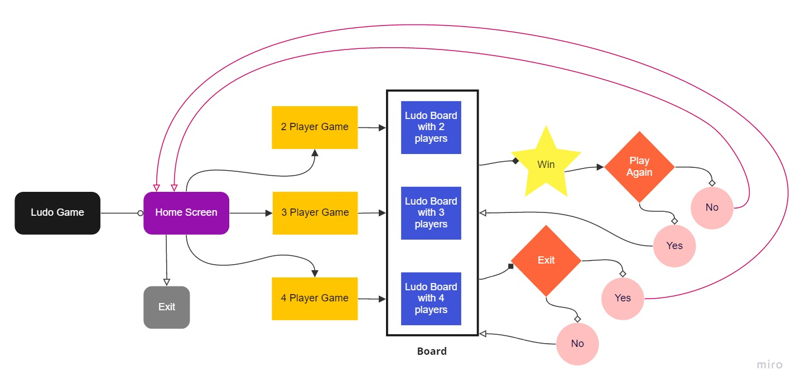
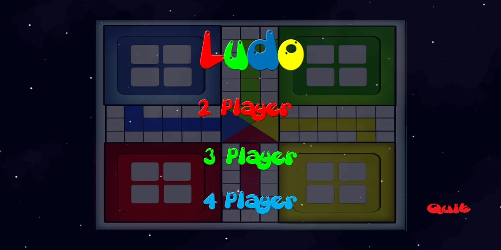
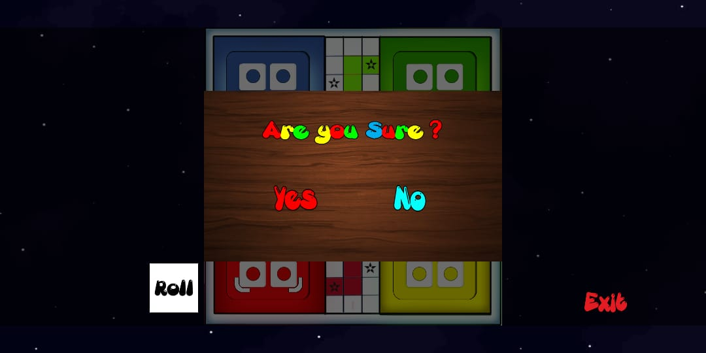
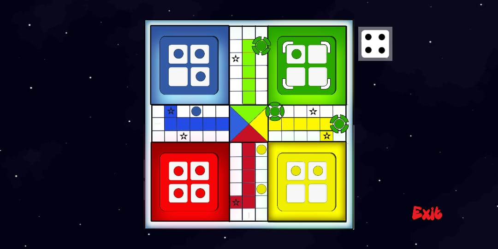
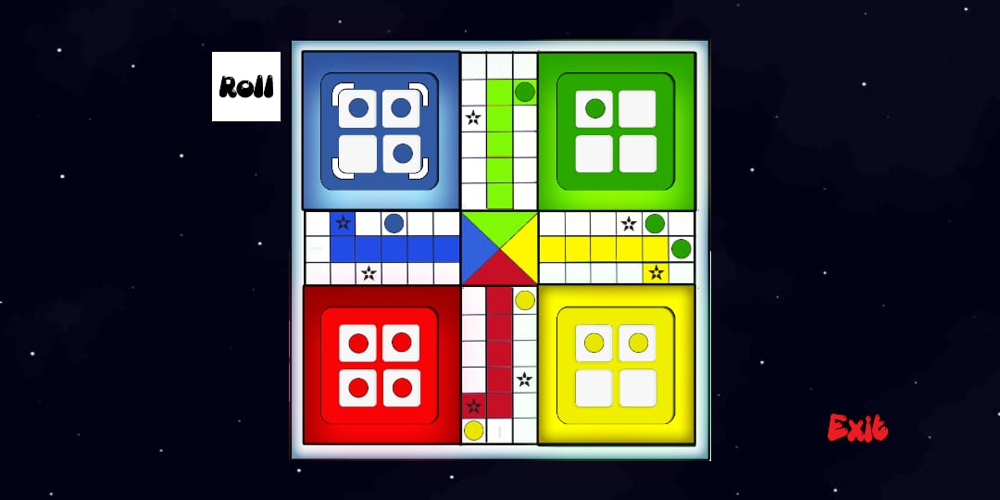

# LUDO

## Multiplayer ludo game made in Unity

This a multi-plaayer game. But due to lack of budget I am not able to make it online multi-player. So users have to play it on a single device.

source code revealing soon...

## Features

<ul>
  <li>Optimized only for Android devices</li>
  <li>2 Player or 3 Player or 4 players can play at a time</li>
  <li>All the rules of Traditional Ludo Game is maintained during developing</li>
  <li>Start screen, Winning Screen, Exit Screen included</li>
  <li>Cheerful Background Music</li>
  <li>Simple user friendly UI</li>
  <li><b>Fact:</b> Over 4000+ lines of code written in C# to make this whole app run</li>
</ul>

## Flowchart 

## Future Updates

<ul>
  <li>Adding app icon</li>
  <li>Adding User Authentication and Authorization</li>
  <li>Adding Online Muti-player feature</li>
  <li>Adding Points for every player</li>
  <li>Adding Cross Platform support</li>
  <li>Updating the game UI</li>
  <li>Improving Animations of Multiple Color Buttons on Same Cell</li>
</ul>

## Sample Game Screens

  
  
  
  
 

